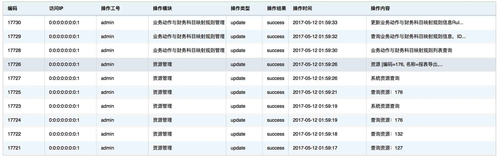
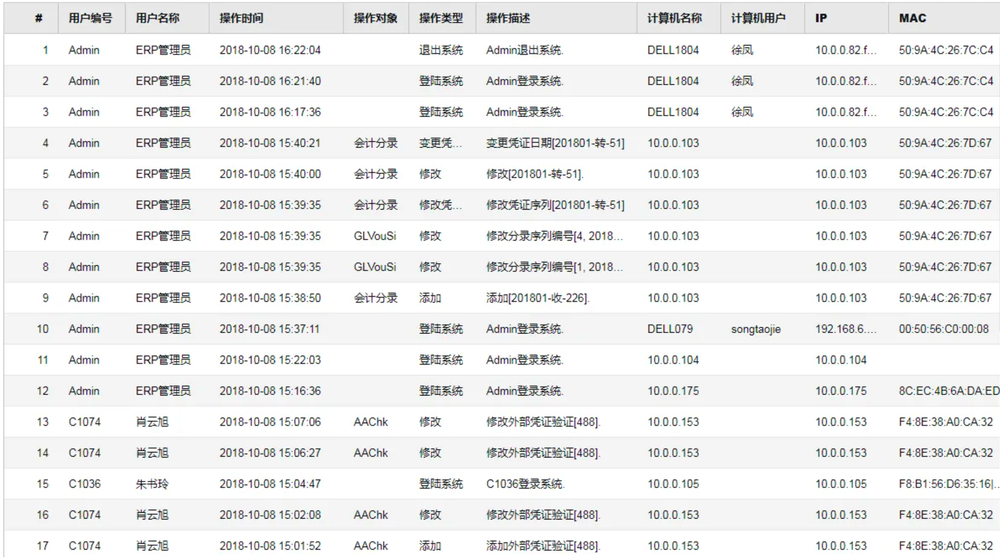
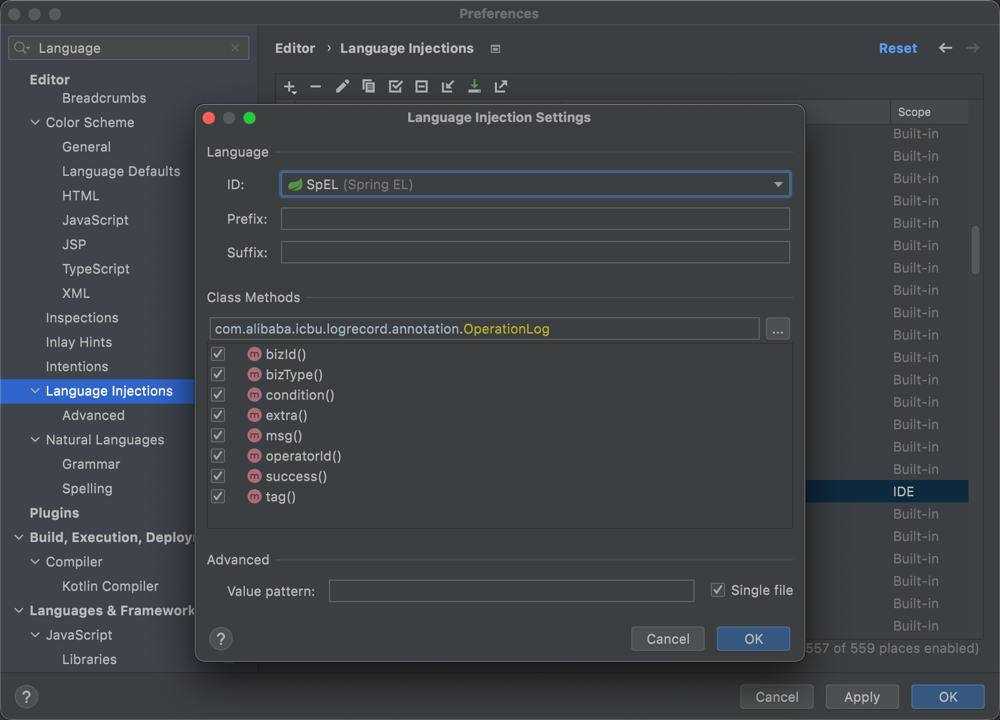

<div align="center">

# log-record

**README:** [简体中文](README.md) · [English](README-EN.md) · **日本語** · [Português (Brasil)](README-PT-BR.md)

[](https://github.com/qqxx6661/log-record/actions/workflows/ci.yml)
[](https://codecov.io/gh/qqxx6661/log-record/branch/master)
[](https://search.maven.org/artifact/cn.monitor4all/log-record-starter)
[](https://www.apache.org/licenses/LICENSE-2.0.html)
[](https://github.com/qqxx6661/log-record/stargazers)
[](https://github.com/qqxx6661/log-record/issues)
[](https://github.com/qqxx6661/log-record/pulls)

</div>

> **注記**
> このリポジトリは、[Meituan Tech Blog の操作ログに関する記事](https://tech.meituan.com/2021/09/16/operational-logbook.html)から着想を得ています。記事の著者が公開した実装をお探しの場合は、[mzt-biz-log](https://github.com/mouzt/mzt-biz-log/)をご覧ください。本プロジェクトは記事で紹介された機能の大部分を独自に実装し、本番環境での知見とコミュニティからのフィードバックを取り入れながら継続的に改善しています。

`log-record` は、Java アノテーションを使って操作ログを簡潔に記録するためのライブラリです。SpEL 式、カスタムコンテキスト、カスタム関数、オブジェクトの差分比較などをサポートします。生成したログはアプリケーション内で処理することも、設定済みのメッセージキューへ送信することもできます。Spring Boot 1・2・3、および JDK 8〜JDK 21 に対応しています。

Spring Boot Starter として提供されているため、依存関係を一つ追加し、アノテーションを一つ付けるだけで利用できます。ビジネスロジックにログ処理を混在させる必要はありません。

```java
@OperationLog(
    bizType = "'followerChange'",
    bizId = "#request.orderId",
    msg = "'ユーザー ' + #queryUserName(#request.userId)"
        + " + ' が注文の担当者を ' + #queryOldFollower(#request.orderId)"
        + " + ' から ' + #request.newFollower + ' に変更しました'"
)
public Response<T> function(Request request) {
    // ビジネスロジック
}
```

Spring Boot 1 または 2（JDK 8 以上）の場合：

```xml
<dependency>
    <groupId>cn.monitor4all</groupId>
    <artifactId>log-record-starter</artifactId>
    <version>{latest-version}</version>
</dependency>
```

Spring Boot 3（JDK 17 以上）の場合：

```xml
<dependency>
    <groupId>cn.monitor4all</groupId>
    <artifactId>log-record-springboot3-starter</artifactId>
    <version>{latest-version}</version>
</dependency>
```

最新バージョンは [Maven Central](https://mvnrepository.com/artifact/cn.monitor4all/log-record-starter) で確認できます。

## 背景

次のような操作ログを見たことがあるでしょう。





このようなログをコード上で読みやすく記録するには、どうすればよいでしょうか。

最も単純な方法は、ログ記録用のユーティリティを呼び出すことです。

```java
String template = "ユーザー%sが注文の担当者を%sから%sに変更しました";
LogUtil.log(orderNo, String.format(template, "Alice", "Bob", "Carol"), "Alice");
```

しかし、この方法ではログの組み立て処理がビジネスコードに入り込み、可読性と保守性が急速に低下します。

ログの定義をアノテーションに移すと、メソッド本体から分離できます。

```java
@OperationLog(
    bizType = "'followerChange'",
    bizId = "'20211102001'",
    msg = "'ユーザー Alice が注文の担当者を Bob から Carol に変更しました'"
)
public Response<T> function(Request request) {
    // ビジネスロジック
}
```

ただし、注文 ID、ユーザー情報、データベース内の変更前の値、リクエストに含まれる変更後の値を、固定文字列ではなく動的に渡す必要があります。

[Spring Expression Language（SpEL）](https://docs.spring.io/spring-framework/docs/3.0.x/reference/expressions.html)を使うと、アノテーションからメソッド引数を参照できます。

- 注文 ID：`#request.orderId`
- 新しい担当者：`#request.newFollower`

```java
@OperationLog(
    bizType = "'followerChange'",
    bizId = "#request.orderId",
    msg = "'注文の担当者を Bob から ' + #request.newFollower + ' に変更しました'"
)
public Response<T> function(Request request) {
    // ビジネスロジック
}
```

現在のユーザーや変更前の担当者のように、メソッド内で取得する値は通常、引数には含まれません。`LogRecordContext` を利用すると、メソッド内で計算した値を SpEL に公開できます。

```java
@OperationLog(
    bizType = "'followerChange'",
    bizId = "#request.orderId",
    msg = "'ユーザー ' + #userName + ' が担当者を '"
        + " + #oldFollower + ' から ' + #request.newFollower + ' に変更しました'"
)
public Response<T> function(Request request) {
    LogRecordContext.putVariable("userName", queryUserName(request.getUserId()));
    LogRecordContext.putVariable("oldFollower", queryOldFollower(request.getOrderId()));
}
```

さらにカスタム SpEL 関数を登録すれば、メソッド本体にログ用コードを追加せずに値を取得できます。

```java
@OperationLog(
    bizType = "'followerChange'",
    bizId = "#request.orderId",
    msg = "'ユーザー ' + #queryUserName(#request.userId)"
        + " + ' が担当者を ' + #queryOldFollower(#request.orderId)"
        + " + ' から ' + #request.newFollower + ' に変更しました'"
)
public Response<T> function(Request request) {
    // ビジネスロジック
}
```

これが本ライブラリの基本的な考え方です。

## プロジェクト概要

`log-record` は、アノテーションによって操作ログを記録し、ログ実装とビジネスロジックを分離します。

### 主な機能

- **簡単な導入：** `pom.xml` に Spring Boot Starter を追加するだけです。
- **非侵入的：** アノテーションベースであり、ログ処理の例外は元のメソッドに影響しません。
- **SpEL 対応：** メソッド引数や関数を使って動的なログ項目を作成できます。
- **オブジェクト差分：** 同じクラスだけでなく、異なるクラスのオブジェクトも比較できます。
- **条件付きログ：** SpEL の `condition` を満たす場合のみ記録します。
- **カスタムコンテキスト：** 任意のキーと値を SpEL に公開できます。
- **カスタム関数：** SpEL から呼び出せる関数を登録できます。
- **グローバル操作者 ID：** 現在の操作者を取得する共通ロジックを設定できます。
- **差し替え可能なデータパイプライン：** データベース、TLog、メッセージキューなどへ送信できます。
- **反復可能なアノテーション：** 一つのメソッドに複数の操作ログを定義できます。
- **再試行とフォールバック：** 再試行回数と、失敗時の SPI ハンドラーを設定できます。
- **実行タイミングの制御：** メソッド実行前または実行後に式を評価できます。
- **成功判定のカスタマイズ：** ビジネス上の成功条件を式で指定できます。
- **手動記録：** アノテーションを使わずにログを作成できます。
- **カスタムスレッドプール：** 非同期処理用 Executor を差し替えられます。

### ログデータ

`LogDTO` には次の項目が含まれます。

```text
logId: 自動生成される UUID
bizId: ビジネス上の一意な ID
bizType: ビジネス種別
exception: メソッド失敗時の例外情報
operateDate: 操作日時
success: 操作が成功したかどうか
msg: ログメッセージ
tag: カスタムタグ
returnStr: 文字列または JSON に変換された戻り値
executionTime: メソッドの実行時間（ミリ秒）
extra: 追加情報
operatorId: 操作者 ID
diffDTOList: フィールド名、値、クラス名などの差分情報
```

## 使用方法

導入は 3 ステップです。

### ステップ 1：依存関係を追加する

Spring Boot 1 または 2（JDK 8 以上）：

```xml
<dependency>
    <groupId>cn.monitor4all</groupId>
    <artifactId>log-record-starter</artifactId>
    <version>{latest-version}</version>
</dependency>
```

Spring Boot 3（JDK 17 以上）：

```xml
<dependency>
    <groupId>cn.monitor4all</groupId>
    <artifactId>log-record-springboot3-starter</artifactId>
    <version>{latest-version}</version>
</dependency>
```

最新バージョンは [Maven Central](https://search.maven.org/artifact/cn.monitor4all/log-record-starter) で確認してください。1.6.x 以降を推奨します。

### ステップ 2：ログの処理方法を選択する

次の方法を利用できます。

1. アプリケーション内で独自に処理する。
2. RabbitMQ へ直接送信する。
3. RocketMQ へ直接送信する。
4. Spring Cloud Stream 経由で送信する。

#### アプリケーション内で処理する

同じアプリケーション内でログを処理する場合は、`IOperationLogGetService` を実装します。

```java
@Component
public class CustomOperationLogGetService implements IOperationLogGetService {
    @Override
    public boolean createLog(LogDTO logDTO) {
        log.info("logDTO: [{}]", JSON.toJSONString(logDTO));
        return true;
    }
}
```

#### RabbitMQ

```properties
log-record.data-pipeline=rabbitMq
log-record.rabbit-mq-properties.host=localhost
log-record.rabbit-mq-properties.port=5672
log-record.rabbit-mq-properties.username=admin
log-record.rabbit-mq-properties.password=xxxxxx
log-record.rabbit-mq-properties.queue-name=logRecord
log-record.rabbit-mq-properties.routing-key=
log-record.rabbit-mq-properties.exchange-name=logRecord
```

#### RocketMQ

```properties
log-record.data-pipeline=rocketMq
log-record.rocket-mq-properties.topic=logRecord
log-record.rocket-mq-properties.tag=
log-record.rocket-mq-properties.group-name=logRecord
log-record.rocket-mq-properties.namesrv-addr=localhost:9876
```

#### Spring Cloud Stream

```properties
log-record.data-pipeline=stream
log-record.stream.destination=logRecord
log-record.stream.group=logRecord
# 空の場合、spring.cloud.stream.default-binder で指定した Binder を使用します。
log-record.stream.binder=
# RocketMQ Binder の例
spring.cloud.stream.rocketmq.binder.name-server=127.0.0.1:9876
spring.cloud.stream.rocketmq.binder.enable-msg-trace=false
```

### ステップ 3：対象メソッドにアノテーションを付ける

```java
@OperationLog(
    bizType = "'followerChange'",
    bizId = "#request.orderId",
    msg = "'注文の担当者を Bob から ' + #request.newFollower + ' に変更しました'"
)
public Response<T> function(Request request) {
    // ビジネスロジック
}
```

## 高度な機能

- [SpEL の使用](#spel-の使用)
- [SpEL の評価タイミング](#spel-の評価タイミング)
- [組み込みパラメーターと関数](#組み込みパラメーターと関数)
- [条件付きログ](#条件付きログ)
- [グローバル操作者情報](#グローバル操作者情報)
- [カスタムコンテキスト](#カスタムコンテキスト)
- [カスタム関数](#カスタム関数)
- [成功判定のカスタマイズ](#成功判定のカスタマイズ)
- [オブジェクト差分](#オブジェクト差分)
- [再試行とフォールバック](#再試行とフォールバック)
- [反復可能なアノテーション](#反復可能なアノテーション)
- [カスタムメッセージスレッドプール](#カスタムメッセージスレッドプール)
- [戻り値の記録](#戻り値の記録)
- [手動ログ](#手動ログ)
- [推奨データベーススキーマ](#推奨データベーススキーマ)
- [IntelliJ IDEA での SpEL 補完](#intellij-idea-での-spel-補完)

### SpEL の使用

SpEL は Spring が提供する標準の式言語です。基本的な構文は [Spring Framework ドキュメント](https://docs.spring.io/spring-framework/docs/3.0.x/reference/expressions.html)を参照してください。

boolean 型の `executeBeforeFunc` と `recordReturnValue` を除き、`@OperationLog` のすべての属性は有効な SpEL 式でなければなりません。

たとえば `bizType = "orderCreate"` と書くと、SpEL は `orderCreate` をプロパティ名またはメソッド名として解釈します。文字列リテラルには内側の引用符が必要です。

```java
@OperationLog(bizType = "'orderCreate'")
```

定数や列挙型も参照できます。

```java
@OperationLog(bizId = "'1'", bizType = "T(cn.monitor4all.logRecord.test.bean.TestConstant).TYPE1")
@OperationLog(bizId = "'2'", bizType = "T(cn.monitor4all.logRecord.test.bean.TestEnum).TYPE1.key")
```

> バージョン 1.2.0 以降では、`bizType` と `tag` にも有効な SpEL が必要です。1.1.x 以前では通常の文字列として扱われます。

### SpEL の評価タイミング

デフォルトでは、ログ用の Aspect は対象メソッドの実行後に動作します。メソッドが引数を変更した場合、SpEL からは変更後の値が見えます。

`executeBeforeFunc = true` を指定すると、メソッド実行前に SpEL を評価できます。ただし、メソッド内で作成されるカスタムコンテキストや戻り値は利用できません。

```java
@OperationLog(bizId = "#keyInBiz", bizType = "'before'", executeBeforeFunc = true)
@OperationLog(bizId = "#keyInBiz", bizType = "'after'")
public void testExecuteBeforeFunc() {
    LogRecordContext.putVariable("keyInBiz", "valueInBiz");
}
```

### 組み込みパラメーターと関数

次のパラメーターは登録せずに利用できます。

- `_return`：元のメソッドの戻り値。
- `_errorMsg`：元のメソッドで発生した例外のメッセージ（`throwable.getMessage()`）。

```java
@OperationLog(bizId = "'1'", bizType = "'testReturn'", msg = "#_return")
```

どちらもメソッド実行後に設定されるため、`executeBeforeFunc = true` の場合は `null` です。組み込み関数 `_DIFF` については「オブジェクト差分」を参照してください。

### 条件付きログ

`condition` 属性に SpEL を指定すると、条件を満たす場合だけログを作成できます。

```java
@OperationLog(bizId = "'1'", bizType = "'notNull'", condition = "#testUser != null")
@OperationLog(bizId = "'2'", bizType = "'idIs1'", condition = "#testUser.id == 1")
@OperationLog(bizId = "'3'", bizType = "'idIs2'", condition = "#testUser.id == 2")
public void testCondition(TestUser testUser) {
}
```

`new TestUser(1, "Alice")` を渡すと、最初の 2 件だけが記録されます。

### グローバル操作者情報

操作者 ID は、社内 ID 基盤、外部 API、またはデータベースから取得することが一般的です。`IOperatorIdGetService` を実装すると、プロジェクト全体の取得方法を定義できます。

```java
@Component
public class OperatorIdGetServiceImpl implements IOperatorIdGetService {
    @Override
    public String getOperatorId() {
        return queryCurrentOperatorId();
    }
}
```

アノテーションで明示的に指定した操作者 ID は、グローバル値より優先されます。

### カスタムコンテキスト

`LogRecordContext` に任意の値を追加し、SpEL から参照できます。

```java
LogRecordContext.putVariable("userName", queryUserName(request.getUserId()));
LogRecordContext.putVariable("oldFollower", queryOldFollower(request.getOrderId()));
```

内部では `TransmittableThreadLocal` を使用して、メインスレッドのコンテキストを引き継ぎます。

### カスタム関数

登録するクラスとメソッドの両方に `@LogRecordFunc` を付けます。`value` には任意の別名を指定できます。バージョン 1.6.x 以降では static メソッドだけがサポートされます。

```java
@LogRecordFunc("CustomFunction")
public class CustomFunction {
    @LogRecordFunc("withAlias")
    public static String methodWithAlias() {
        return "withAlias";
    }

    @LogRecordFunc
    public static String methodWithoutAlias() {
        return "withoutAlias";
    }
}
```

登録名は `CustomFunction_withAlias` と `CustomFunction_methodWithoutAlias` です。登録済み関数は起動ログに出力されます。

```java
@OperationLog(
    bizId = "#CustomFunction_withAlias()",
    bizType = "'testCustomFunction'"
)
public void testCustomFunction() {
}
```

1.5.x の一部ではリフレクションを使った非 static 関数も利用できましたが、JDK 11 以降との互換性が低いため 1.6.x で削除されました。

### 成功判定のカスタマイズ

`success` 属性を使うと、戻り値などに基づいてビジネス上の成功を判定できます。式を指定しない場合、例外を送出せずに終了したメソッドが成功とみなされます。

```java
@OperationLog(
    success = "#isSuccess",
    bizId = "#request.trade.id",
    bizType = "'createOrder'"
)
public Result<Void> createOrder(Request request) {
    Response response = tradeCreateService.create(request);
    LogRecordContext.putVariable("isSuccess", response.getIsSuccess());
    return response.getIsSuccess() ? Result.ofSuccess() : Result.ofSysError();
}
```

### オブジェクト差分

同じクラスまたは異なるクラスのオブジェクトを比較できます。

- `@LogRecordDiffField`：フィールドに付け、`alias` や `ignored = true` を指定します。
- `@LogRecordDiffObject`：クラスに付け、任意の `alias` を指定します。デフォルトではすべてのフィールドが対象です。

```java
@LogRecordDiffObject(alias = "ユーザー")
public class TestUser {
    @LogRecordDiffField(alias = "社員 ID")
    private Integer id;
    private String name;
    private String job;
}
```

組み込み関数 `_DIFF` に変更前と変更後のオブジェクトを渡します。

```java
@OperationLog(
    bizId = "'1'",
    bizType = "'testObjectDiff'",
    msg = "#_DIFF(#oldObject, #testUser)",
    extra = "#_DIFF(#oldObject, #testUser)"
)
public void testObjectDiff(TestUser testUser) {
    LogRecordContext.putVariable("oldObject", new TestUser(1, "Alice"));
}
```

`testObjectDiff(new TestUser(2, "Bob"))` を呼び出すと、差分が `diffDTOList` に保存され、`msg` と `extra` に整形されます。

新旧オブジェクトの `null` フィールドは個別に無視できます。

```properties
# デフォルトは false
log-record.diff-ignore-new-object-null-value=true
log-record.diff-ignore-old-object-null-value=true
```

標準の差分メッセージと区切り文字も変更できます。

```properties
log-record.diff-msg-format=【${_fieldName}】が【${_oldValue}】から【${_newValue}】に変更されました
log-record.diff-msg-separator=;
```

同じアノテーション内で `_DIFF` を複数回呼び出すこともできます。単純値は `equals` で比較し、複雑な値は Fastjson の `JSONObject` に変換して Map として比較します。

### 再試行とフォールバック

ローカルハンドラーとメッセージパイプラインのどちらにも再試行を設定できます。

```properties
# デフォルトは 0 回。つまり合計 1 回実行されます。
log-record.retry.retry-times=5
```

すべての試行が失敗した場合の処理は、`cn.monitor4all.logRecord.service.LogRecordErrorHandlerService` を実装して定義します。

```java
@Component
public class LogRecordErrorHandlerServiceImpl implements LogRecordErrorHandlerService {
    @Override
    public void operationLogGetErrorHandler() {
        log.error("ローカルログ処理が最大再試行回数を超えました");
    }

    @Override
    public void dataPipelineErrorHandler() {
        log.error("データパイプラインが最大再試行回数を超えました");
    }
}
```

### 反復可能なアノテーション

```java
@OperationLog(bizId = "#testClass.testId", bizType = "'type1'", msg = "#testFunc(#testClass.testId)")
@OperationLog(bizId = "#testClass.testId", bizType = "'type2'", msg = "#testFunc(#testClass.testId)")
@OperationLog(bizId = "#testClass.testId", bizType = "'type3'", msg = "'値を変更しました'")
```

一つのメソッドに複数の `@OperationLog` を付けられます。ログはアノテーションの上から下の順で出力されます。

### カスタムメッセージスレッドプール

```properties
# コアスレッド数。デフォルトは 4
log-record.thread-pool.pool-size=4
# デフォルトは true。false の場合はビジネススレッドで処理します。
log-record.thread-pool.enabled=true
```

`LogDTO` の組み立て後、デフォルトではスレッドプールがローカルリスナーまたはメッセージキューの Sender を呼び出します。`LogDTO` 自体は元のメソッドを実行したスレッド上で組み立てられます。

デフォルトの Executor は次の構成です。

```java
return new ThreadPoolExecutor(
    poolSize,
    poolSize,
    0L,
    TimeUnit.SECONDS,
    new LinkedBlockingQueue<>(1024),
    THREAD_FACTORY,
    new ThreadPoolExecutor.AbortPolicy()
);
```

独自の Executor を使用する場合は `cn.monitor4all.logRecord.thread.ThreadPoolProvider` を実装します。

```java
public class CustomThreadPoolProvider implements ThreadPoolProvider {
    private static final ThreadPoolExecutor EXECUTOR = new ThreadPoolExecutor(
        3, 3, 0L, TimeUnit.SECONDS,
        new LinkedBlockingQueue<>(100),
        new CustomizableThreadFactory("custom-log-record-"),
        new ThreadPoolExecutor.AbortPolicy()
    );

    @Override
    public ThreadPoolExecutor buildLogRecordThreadPool() {
        return EXECUTOR;
    }
}
```

### 戻り値の記録

`@OperationLog.recordReturnValue()` は、メソッドの戻り値を記録するかどうかを制御します。大きなオブジェクトのシリアライズによる負荷を避けるため、デフォルトでは無効です。

### 手動ログ

アノテーションが適さない場合は、`cn.monitor4all.logRecord.util.OperationLogUtil` を使って直接記録できます。

```java
LogRequest logRequest = LogRequest.builder()
    .bizId("testBizId")
    .bizType("testBuildLogRequest")
    .success(true)
    .msg("testMsg")
    .tag("testTag")
    .returnStr("testReturnStr")
    .extra("testExtra")
    .build();

OperationLogUtil.log(logRequest);
```

手動ログでは、SpEL やカスタム関数などのアノテーション固有機能は利用できません。

### 推奨データベーススキーマ

次の MySQL スキーマをアプリケーションに合わせて調整できます。

```sql
CREATE TABLE `operation_log` (
  `id` bigint(20) unsigned NOT NULL AUTO_INCREMENT COMMENT '主キー',
  `gmt_create` datetime NOT NULL COMMENT '作成日時',
  `gmt_modified` datetime NOT NULL ON UPDATE CURRENT_TIMESTAMP COMMENT '更新日時',
  `biz_id` varchar(128) NOT NULL COMMENT 'ビジネス ID',
  `biz_type` varchar(64) DEFAULT NULL COMMENT 'ビジネス種別',
  `tag` varchar(64) DEFAULT NULL COMMENT 'タグ',
  `operation_date` datetime DEFAULT NULL COMMENT '操作日時',
  `msg` varchar(512) DEFAULT NULL COMMENT '操作内容',
  `extra` varchar(512) DEFAULT NULL COMMENT '追加情報',
  `operation_status` tinyint(4) DEFAULT NULL COMMENT '操作結果',
  `operation_time` int(11) DEFAULT NULL COMMENT '実行時間',
  `content_return` varchar(512) COMMENT '戻り値',
  `content_exception` varchar(512) COMMENT '例外内容',
  `operator_id` varchar(32) DEFAULT NULL COMMENT '操作者 ID',
  `operator_name` varchar(32) DEFAULT NULL COMMENT '操作者名',
  PRIMARY KEY (`id`),
  KEY `idx_biz_id` (`biz_id`)
) ENGINE=InnoDB DEFAULT CHARSET=utf8mb4 COMMENT='操作ログ';
```

### IntelliJ IDEA での SpEL 補完

`@Cacheable` などのアノテーション補完は IDE が提供しています。IntelliJ IDEA の SpEL アノテーション設定に本ライブラリのアノテーションを追加すると、補完と式の検証を有効にできます。



## Spring Boot 3（JDK 17 以上）での相違点

Spring Boot の各バージョンで同じ機能を提供することを目指していますが、JDK のリフレクション制限により、メソッド引数の参照方法が異なります。

### メソッド引数名

Spring Boot 3 モジュールでは、SpEL から Java の引数名ではなく `p0`、`p1` などの位置名を使用してください。

Spring Boot 1・2：

```java
@OperationLog(bizId = "#bizId", bizType = "'testBizIdWithSpEL'")
public void testBizIdWithSpEL(String bizId) {
}
```

Spring Boot 3：

```java
@OperationLog(bizId = "#p0", bizType = "'testBizIdWithSpEL'")
public void testBizIdWithSpEL(String bizId) {
}
```

## ユースケース

### 操作ログ

CRM などでユーザーがデータを編集した後、変更内容を人が読める監査ログとして保存できます。

### システムログ

メソッドの実行時間、引数、戻り値など、システムレベルの情報も記録できます。

### バックエンドイベント

システムログと同様に、ユーザー操作を分析用イベントとして記録できます。

### 通知

重要な操作ログをメッセージとして公開し、アプリケーション間の通知に利用できます。

## デモ

単体テストには各機能の詳しい使用例が含まれています。

Spring Boot 2・3 の完全なデモは [qqxx6661/systemLog](https://github.com/qqxx6661/systemLog) にあります。

## リリースノート

[GitHub Releases](https://github.com/qqxx6661/log-record/releases) を参照してください。

## 付録

### ビルド時の注意

親子モジュールに分割されているため、対象 JDK で `log-record-core` を再ビルドしてから、対応する `log-record-starter` をビルドしてください。順序が異なると、コンパイルまたは単体テストが失敗する場合があります。

### リリース時の注意

`log-record-core`、`log-record-starter`、`log-record-springboot3-starter` をまとめて Maven Central に公開してください。

### 関連記事

- [アノテーションで操作ログを簡潔に記録する方法](https://mp.weixin.qq.com/s/q2qmffH8t-ou2apOa6BiPQ)（中国語）
- [プロジェクトを Maven Central に公開する方法](https://mp.weixin.qq.com/s/B9LA6be_cPAKACbZot_Nrg)（中国語）

### 作者をフォロー

- WeChat 公式アカウント：后端技术漫谈
- ブログ名：蛮三刀酱

このプロジェクトが役に立った場合は、Star を付けていただけると嬉しいです。

### Star の推移

[](https://star-history.com/#qqxx6661/log-record&Date)
