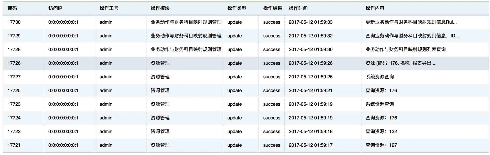
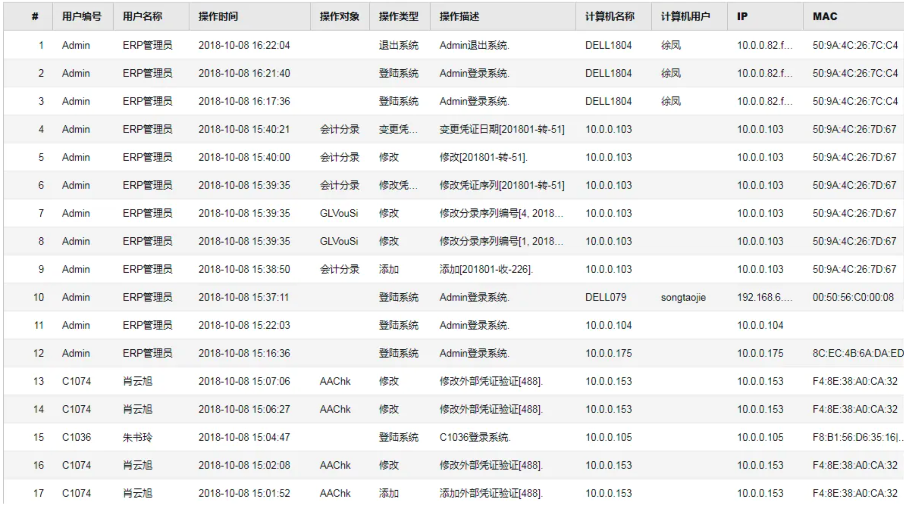
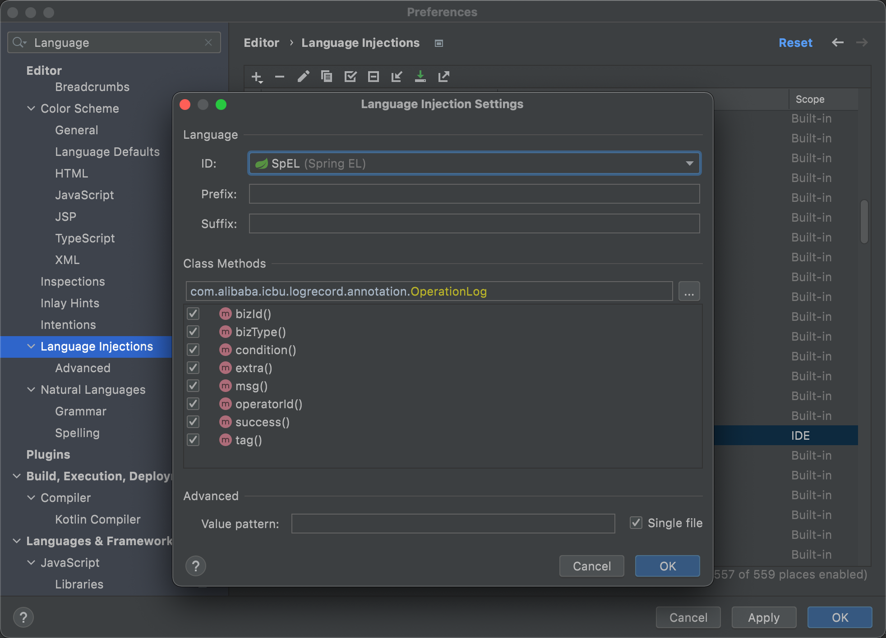

# log-record


> 注意：本仓库灵感来源于[美团技术博客](https://tech.meituan.com/2021/09/16/operational-logbook.html) ，若您需要寻找的是美团仓库，可以跳转[这里](https://github.com/mouzt/mzt-biz-log/) 。


通过Java注解优雅的记录操作日志，并支持SpEL表达式，自定义上下文，自定义函数，实体类DIFF等功能，最终日志可由用户自行处理或推送至指定消息队列。

采用SpringBoot Starter的方式，只需一个依赖。

```
<dependency>
    <groupId>cn.monitor4all</groupId>
    <artifactId>log-record-starter</artifactId>
    <version>1.2.1</version>
</dependency>
```

最新版本号请查阅[Maven公共仓库](https://search.maven.org/artifact/cn.monitor4all/log-record-starter)

只需一句注解，日志轻松记录，不侵入业务逻辑：

```
@OperationLog(bizType = "'addressChange'", bizId = "#request.orderId", msg = "'用户' + #queryUserName(#request.userId) + '修改了订单的跟进人：从' + #oldAddress + '修改到' + #queryOldAddress(#request.orderId)")
public Response<T> function(Request request) {
  // 业务执行逻辑
}
```

## 项目背景

大家一定见过下图的操作日志：





在代码层面，如何优雅的记录上面的日志呢？

能想到最粗暴的方式，**封装一个操作日志记录类**，如下：

```
String template = "用户%s修改了订单的跟进人：从“%s”修改到“%s”"
LogUtil.log(orderNo, String.format(tempalte, "张三", "李四", "王五"),  "张三")
```

这种方式会导致业务代码被记录日志的代码侵入，**对于代码的可读性和可维护性来说是一个灾难。**

这个方式显然不够优雅，让我们试试使用注解：

```
@OperationLog(bizType = "'addressChange'", bizId = "'20211102001'", msg = "'用户 张三 修改了订单的跟进人：从 李四 修改到 王五'")
public Response<T> function(Request request) {
  // 业务执行逻辑
}
```

日志的记录被放到了注解，对业务代码没有侵入。

但是新的问题来了，我们该如何把**订单ID，用户信息，数据库里的旧地址，函数入参的新地址传递给注解呢？**

Spring的 [SpEL表达式（Spring Expression Language）](https://docs.spring.io/spring-framework/docs/3.0.x/reference/expressions.html) 可以帮助我们，通过引入SpEL表达式，我们可以获取函数的入参。这样我们就可以对上面的注解进行修改：

- 订单ID：#request.orderId
- 新地址"王五"：#request.newAddress

```
@OperationLog(bizType = "'addressChange'", bizId = "#request.orderId", msg = "'用户 张三 修改了订单的跟进人：从 李四 修改到' + #request.newAddress")
public Response<T> function(Request request) {
  // 业务执行逻辑
}
```

如此一来，订单ID和地址的新值就可以通过解析入参动态获取了。

问题还没有结束，通常我们的用户信息（user），以及老的跟进人（oldAddress），是需要在方法中查询后才能获取，**入参里一般不会包含这些数据。**

解决方案也不是没有，我们创建一个可以保存上下文的LogRecordContext变量，**让用户手动传递代码中计算出来的值，再交给SpEL解析** ，代码如下

```
@OperationLog(bizType = "'addressChange'", bizId = "#request.orderId", msg = "'用户' + #userName + '修改了订单的跟进人：从' + #oldAddress + '修改到' + #request.newAddress")
public Response<T> function(Request request) {
  // 业务执行逻辑
  ...
  // 手动传递日志上下文：用户信息 地址旧值
  LogRecordContext.putVariables("userName", queryUserName(request.getUserId()));
  LogRecordContext.putVariables("oldAddress", queryOldAddress(request.getOrderId()));
}
```

什么？你说这不就又侵入了业务逻辑了么？

确实是的，不过这种方法足够便捷易懂，并不会有什么理解的困难。

**但是对于有“强迫症”的同学，这样的实现还是不够优雅，我们可以用SpEL支持的自定义函数，解决这个问题。**

SpEL支持在表达式中传入用户自定义函数，我们将queryUserName和queryOldAddress这两个函数提前放入SpEL的解析器中，SpEL在解析表达式时，会执行对应函数。

最终，我们的注解变成了这样，并且最终记录了日志：

```
@OperationLog(bizType = "'addressChange'", bizId = "#request.orderId", msg = "'用户' + #queryUserName(#request.userId) + '修改了订单的跟进人：从' + #oldAddress + '修改到' + #queryOldAddress(#request.orderId)")
public Response<T> function(Request request) {
  // 业务执行逻辑
}
```

> 用户 张三 修改了订单的跟进人：从 李四 修改到 王五

**以上便是本库的大致实现原理。**

## 项目介绍

本库帮助你通过注解优雅地记录项目中的操作日志，对业务代码无侵入。

此外，你可以方便地将所有日志推送到下列数据管道：

1. 本地处理
2. 发送至RabbitMQ
3. 发送至RocketMQ
4. 发送至SpringCloud Stream

本项目特点：

- 快速接入：使用Spring Boot Starter实现，用户直接在pom.xml引入依赖即可使用
- 业务无侵入：无需侵入业务代码，日志切面发生任何异常不会影响原方法执行
- SpEL解析：支持SpEL表达式
- 实体类Diff：支持相同甚至不同类对象的Diff
- 条件注解：满足Condition条件后才记录日志，通过SpEL进行解析
- 自定义上下文：支持手动传递键值对，通过SpEL进行解析
- 自定义函数：支持注册自定义函数，通过SpEL进行解析
- 全局操作人ID：自定义操作人ID获取逻辑
- 指定日志数据管道：自定义操作日志处理逻辑（写数据库，TLog等..）
- 支持重复注解：同一个方法上可以写多个操作日志注解
- 支持MetaQ：快速配置MetaQ数据管道，将日志写入MetaQ
- 支持控制切面执行时机（方法执行前后），支持自定义执行成功判断逻辑，等等....等你来发觉

**日志实体内包含：**

```
logId：生成的UUID
bizId：业务唯一ID
bizType：业务类型
exception：函数执行失败时写入异常信息
operateDate：操作执行时间
success：函数是否执行成功
msg：日志内容
tag：自定义标签
returnStr: 方法执行成功后的返回值（字符串或JSON化实体）
executionTime：方法执行耗时（单位：毫秒）
extra：额外信息
operatorId：操作人ID
List<diffDTO>: 实体类对象Diff数据，包括变更的字段名，字段值，类名等
```

日志实体复杂示例：

```json
{
  "bizId":"1",
  "bizType":"testObjectDiff",
  "executionTime":0,
  "extra":"【用户工号】从【1】变成了【2】 【name】从【张三】变成了【李四】",
  "logId":"38f7f417-2cc3-40ed-8c98-2fe3ee057518",
  "msg":"【用户工号】从【1】变成了【2】 【name】从【张三】变成了【李四】",
  "operateDate":1651116932299,
  "operatorId":"操作人",
  "returnStr":"{\"id\":1,\"name\":\"张三\"}",
  "success":true,
  "exception":null,
  "tag":"operation",
  "diffDTOList":[
    {
      "diffFieldDTOList":[
        {
          "fieldName":"id",
          "newFieldAlias":"用户工号",
          "newValue":2,
          "oldFieldAlias":"用户工号",
          "oldValue":1
        },
        {
          "fieldName":"name",
          "newValue":"李四",
          "oldValue":"张三"
        }],
      "newClassAlias":"用户信息实体",
      "newClassName":"cn.monitor4all.logRecord.test.bean.TestUser",
      "oldClassAlias":"用户信息实体",
      "oldClassName":"cn.monitor4all.logRecord.test.bean.TestUser"
    },
    {
      "diffFieldDTOList":[
        {
          "fieldName":"id",
          "newFieldAlias":"用户工号",
          "newValue":2,
          "oldFieldAlias":"用户工号",
          "oldValue":1
        },
        {
          "fieldName":"name",
          "newValue":"李四",
          "oldValue":"张三"
        }],
      "newClassAlias":"用户信息实体",
      "newClassName":"cn.monitor4all.logRecord.test.bean.TestUser",
      "oldClassAlias":"用户信息实体",
      "oldClassName":"cn.monitor4all.logRecord.test.bean.TestUser"
    }]
}
```


## 使用方法

**只需要简单的三步：**

**第一步：** SpringBoot项目中引入依赖

```
<dependency>
    <groupId>cn.monitor4all</groupId>
    <artifactId>log-record-starter</artifactId>
    <version>{最新版本号}</version>
</dependency>
```

**推荐使用>=1.2.0版本**


**第二步：** 添加数据源配置

支持推送日志数据至：

1. 本地直接处理消息
2. RabbitMQ 
3. RocketMQ
4. SpringCloud Stream

**1. 本地直接处理消息**

若只需要在同一应用内处理日志信息，只需要实现接口IOperationLogGetService，便可对日志进行处理。

```java
public class CustomFuncTestOperationLogGetService implements IOperationLogGetService {
    @Override
    public void createLog(LogDTO logDTO) {
        log.info("logDTO: [{}]", JSON.toJSONString(logDTO));
    }
}
```


**2. RabbitMQ**

配置好RabbitMQ的发送者

```
log-record.data-pipeline=rabbitMq
log-record.rabbit-mq-properties.host=localhost
log-record.rabbit-mq-properties.port=5672
log-record.rabbit-mq-properties.username=admin
log-record.rabbit-mq-properties.password=xxxxxx
log-record.rabbit-mq-properties.queue-name=logRecord
log-record.rabbit-mq-properties.routing-key=
log-record.rabbit-mq-properties.exchange-name=logRecord
```

**3. RocketMQ**

配置好RocketMQ的发送者

```
log-record.data-pipeline=rocketMq
log-record.rocket-mq-properties.topic=logRecord
log-record.rocket-mq-properties.tag=
log-record.rocket-mq-properties.group-name=logRecord
log-record.rocket-mq-properties.namesrv-addr=localhost:9876
```

**4. Stream**

配置好 stream 

```
log-record.data-pipeline=stream
log-record.stream.destination=logRecord
log-record.stream.group=logRecord
# 为空时 默认为spring.cloud.stream.default-binder指定的Binder
log-record.stream.binder=
# rocketmq binder例子
spring.cloud.stream.rocketmq.binder.name-server=127.0.0.1:9876
spring.cloud.stream.rocketmq.binder.enable-msg-trace=false
```

**第三步：** 在需要记录系统操作的方法上，添加注解

```
@OperationLog(bizType = "'addressChange'", bizId = "#request.orderId", msg = "'用户 张三 修改了订单的跟进人：从 李四 修改到' + #request.newAddress")
public Response<T> function(Request request) {
  // 业务执行逻辑
}
```

## 进阶特性

- [SpEL的使用](#SpEL的使用)
- [自定义SpEL解析顺序](#自定义SpEL解析顺序)
- [内置自定义函数和自定义参数](#内置自定义函数和自定义参数)
- [根据条件记录日志](#根据条件记录日志)
- [全局操作人信息获取](#全局操作人信息获取)
- [自定义上下文](#自定义上下文)
- [自定义函数](#自定义函数)
- [自定义原方法是否执行成功](#自定义原方法是否执行成功)
- [实体类Diff](#实体类Diff)
- [重复注解](#重复注解)
- [消息分发线程池配置](#消息分发线程池配置)
- [函数返回值记录开关](#函数返回值记录开关)
- [让注解支持IDEA自动补全](#让注解支持IDEA自动补全)

### SpEL的使用

SpEL是Spring实现的标准的表达式语言，具体的使用可以学习官方文档或者自行搜索资料，入门非常的简单，推荐几篇文章：

http://itmyhome.com/spring/expressions.html

https://docs.spring.io/spring-framework/docs/3.0.x/reference/expressions.html

需要注意的是，@OperationLog注解中，除了executeBeforeFunc和recordReturnValue两个boolean类型的参数，**其他的参数均需要严格遵循SpEL表达式语法。**

举例来说，bizType中我们经常会填入常量，例如订单创建orderCreate, 订单修改orderModify。

在SpEL表达式中，若传入`bizType="orderCreate"`，SpEL会解析失败，因为纯字符串会被认为是一个方法名，导致SpEL找不到方法而报错，需要使用`bizType="'orderCreate'"`，才能被正确解析。

有时，我们会用枚举值和常量值来规范bizType等参数，合理写法如下：

```
@Getter
@AllArgsConstructor
public enum TestEnum {

    TYPE1("type1", "枚举1"),
    TYPE2("type2", "枚举2");

    private final String key;
    private final String name;

}
```

```
public class TestConstant {

    public static final String TYPE1 = "type1";
    public static final String TYPE2 = "type2";

}
```

```
@OperationLog(bizId = "'1'", bizType = "T(cn.monitor4all.logRecord.test.bean.TestConstant).TYPE1")
@OperationLog(bizId = "'2'", bizType = "T(cn.monitor4all.logRecord.test.bean.TestEnum).TYPE1")
@OperationLog(bizId = "'3'", bizType = "T(cn.monitor4all.logRecord.test.bean.TestEnum).TYPE1.key")
@OperationLog(bizId = "'4'", bizType = "T(cn.monitor4all.logRecord.test.bean.TestEnum).TYPE1.name")
```


**注意：bizType和tag参数在>=1.2.0版本以后才要求严格遵循SpEL表达式，<=1.1.x以下版本均为直接填写字符串，不支持SpEL解析。**


### 自定义SpEL解析顺序

在默认配置下，注解切面的逻辑在方法执行之后才会执行，这样会带来一个问题，如果在方法内部修改了方法参数，SpEL解析后取值就变成了改变后的值。

可以使用LogRecordContext写入旧值，避免这个问题，只是有一定代码侵入性。

为了满足一些特殊需求，注解中提供boolean参数executeBeforeFunc，**若设置为true，则会在方法执行前先解析SpEL参数。 这样也会带来负作用，方法内写入的数值，比如自定义上下文，就不再参与SpEL解析了。**

方法上加上注解：

```
@OperationLog(bizId = "#keyInBiz", bizType = "'testExecuteBeforeFunc1'", executeBeforeFunc = true)
@OperationLog(bizId = "#keyInBiz", bizType = "'testExecuteAfterFunc'")
@OperationLog(bizId = "#keyInBiz", bizType = "'testExecuteBeforeFunc2'", executeBeforeFunc = true)
public void testExecuteBeforeFunc() {
    LogRecordContext.putVariables("keyInBiz", "valueInBiz");
}
```

调用方法：

```
testService.testExecuteBeforeFunc();
```

得到结果：

```
[{"bizId":null, "bizType":"testExecuteBeforeFunc1","diffDTOList":[],"executionTime":0,"extra":"","logId":"8cbed2fc-bb2d-48a7-b9ec-f28e99773151","msg":"","operateDate":1651144119444,"operatorId":"操作人","returnStr":"null","success":true,"tag":"operation"}]
[{"bizId":null, "bizType":"testExecuteBeforeFunc2","diffDTOList":[],"executionTime":0,"extra":"","logId":"a130b60c-791c-4c6f-812e-0475de4b38d2","msg":"","operateDate":1651144119444,"operatorId":"操作人","returnStr":"null","success":true,"tag":"operation"}]
[{"bizId":"valueInBiz","bizType":"testExecuteAfterFunc","diffDTOList":[],"executionTime":0,"extra":"","logId":"80af92f5-8e4a-489e-a626-83f2a696fe71","msg":"","operateDate":1651144119444,"operatorId":"操作人","returnStr":"null","success":true,"tag":"operation"}]
```


### 内置自定义函数和自定义参数

1. 可以直接使用的自定义参数：

- _return：原方法的返回值
- _errorMsg：原方法的异常信息（throwable.getMessage()）

使用示例：

```
@OperationLog(bizId = "'1'", bizType = "'testDefaultParamReturn'", msg = "#_return")
```

**注意：_return和_errorMsg均为方法执行后才赋值的参数，所以若executeBeforeFunc=true（设置为方法执行前执行日志切面），则这两个值为null。**

2. 可以直接使用的自定义函数：

- _DIFF：详见下方 **实体类Diff** 小节


### 根据条件记录日志

@OperationLog注解拥有字段condition，用户可以使用SpEL表达式来决定该条日志是否记录。

方法上加上注解：

```
@OperationLog(bizId = "'1'", bizType = "'testCondition1'", condition = "#testUser != null")
@OperationLog(bizId = "'2'", bizType = "'testCondition2'", condition = "#testUser.id == 1")
@OperationLog(bizId = "'3'", bizType = "'testCondition3'", condition = "#testUser.id == 2")
public void testCondition(TestUser testUser) {
}
```

调用方法：

```
testService.testCondition(new TestUser(1, "张三"));
```

上述注解中，只有前两条注解满足condition条件，会输出日志。

### 全局操作人信息获取

大部分情况下，操作人ID往往不会在方法参数中传递，更多会是查询集团内BUC信息、查询外部服务、查表等获取。所以开放了SPI，只需要实现接口IOperationLogGetService，便可以统一注入操作人ID。

```java
public class OperationLogGetService implements IOperatorIdGetService {

    @Override
    public String getOperatorId() {
        // 查询操作人信息
        return "张三";
    }
}
```

**注意：若实现了接口后仍在注解手动传入OperatorID，则以传入的OperatorID优先。**


### 自定义上下文

直接引入类LogRecordContext，放入键值对。

```
@OperationLog(bizType = "'addressChange'", bizId = "#request.orderId", msg = "'用户' + #userName + '修改了订单的跟进人：从' + #oldAddress + '修改到' + #request.newAddress")
public Response<T> function(Request request) {
  // 业务执行逻辑
  ...
  // 手动传递日志上下文：用户信息 地址旧值
  LogRecordContext.putVariables("userName", queryUserName(request.getUserId()));
  LogRecordContext.putVariables("oldAddress", queryOldAddress(request.getOrderId()));
}
```

### 自定义函数

将@LogRecordFunc注解申明在需要注册到SpEL的自定义函数上。

注意，需要在类上也声明@LogRecordFunc，否则无法找到该函数。

@LogRecordFunc可以添加参数value，实现自定义方法别名，若不添加，则默认不需要写前缀

```
@LogRecordFunc("test")
public class CustomFunctionService {

    @LogRecordFunc("testMethodWithCustomName")
    public static String testMethodWithCustomName(){
        return "testMethodWithCustomName";
    }

    @LogRecordFunc
    public static String testMethodWithoutCustomName(){
        return "testMethodWithoutCustomName";
    }

}
```

上述代码中，注册的自定义函数名为`test_testMethodWithCustomName`和`test_testMethodWithoutCustomName`，若类上的注解更改为`@LogRecordFunc("test")`，则注册的自定义函数名为`testMethodWithCustomName`和`testMethodWithoutCustomName`

注意：所有自定义函数可在应用启动时的日志中找到

```
2022-06-09 11:35:18.672  INFO 73757 --- [           main] c.a.i.l.f.CustomFunctionRegistrar        : LogRecord register custom function [public static java.lang.String cn.monitor4all.logRecord.test.service.CustomFunctionService.testMethodWithCustomName()] as name [test_testMethodWithCustomName]
2022-06-09 11:35:18.672  INFO 73757 --- [           main] c.a.i.l.f.CustomFunctionRegistrar        : LogRecord register custom function [public static java.lang.String cn.monitor4all.logRecord.test.service.CustomFunctionService.testMethodWithoutCustomName()] as name [test_testMethodWithoutCustomName]
2022-06-09 11:35:18.672  INFO 73757 --- [           main] c.a.i.l.f.CustomFunctionRegistrar        : LogRecord register custom function [public static java.lang.String cn.monitor4all.logRecord.function.CustomFunctionObjectDiff.objectDiff(java.lang.Object,java.lang.Object)] as name [_DIFF]
```

注解中使用：

```
@OperationLog(bizId = "#test_testMethodWithCustomName()", bizType = "'testMethodWithCustomName'")
@OperationLog(bizId = "#test_testMethodWithoutCustomName()", bizType = "'testMethodWithoutCustomName'")
public void testCustomFunc() {
}
```

### 自定义原方法是否执行成功

@OperationLog注解中有success参数，用于根据返回体或其他情况下自定义日志实体中的success字段。

默认情况下，方法是否执行成功取决于是否抛出异常，若未抛出异常，默认为方法执行成功。

但很多时候，我们的方法执行成功可能取决于方法内部调用的接口的返回值，如下所示：

```
@OperationLog(
        success = "#isSuccess",
        bizId = "#request.trade.id",
        bizType = "'createOrder'",
    )
@Override
public Result<Void> createOrder(Request request) {
    try {
        Response response = tradeCreateService.create(request);
        LogRecordContext.putVariables("isSuccess", response.getIsSuccess());
        return Result.ofSuccess();
    } catch (Exception e) {
        return Result.ofSysError();
    }
}
```

可以通过接口返回的response.getIsSuccess()来表名该创建订单方法是否执行成功。

### 实体类Diff

支持两个类（相同或者不同类皆可）对象的Diff。

在需要对比的字段上申明@LogRecordDiff(alias = "用户工号")，alias别名为可选字段。

在类上也可以申明@LogRecordDiff(alias = "用户信息实体")，但这一步不是必须的，只是为了获取类的别名。

```
@LogRecordDiff(alias = "用户信息实体")
public class TestUser {

    @LogRecordDiff(alias = "用户工号")
    private Integer id;

    @LogRecordDiff
    private String name;

}
```

比较后的结果在日志实体中以diffDTO实体呈现。

```
{
  "diffFieldDTOList":[
    {
      "fieldName":"id",
      "newFieldAlias":"用户工号",
      "newValue":2,
      "oldFieldAlias":"用户工号",
      "oldValue":1
    },
    {
      "fieldName":"name",
      "newValue":"李四",
      "oldValue":"张三"
    }],
  "newClassAlias":"用户信息实体",
  "newClassName":"cn.monitor4all.logRecord.test.bean.TestUser",
  "oldClassAlias":"用户信息实体",
  "oldClassName":"cn.monitor4all.logRecord.test.bean.TestUser"
}
```

在@OperationLog注解上，通过调用内置实现的自定义函数 _DIFF ，传入两个对象即可拿到Diff结果。

```
@OperationLog(bizId = "'1'", bizType = "'testObjectDiff'", msg = "#_DIFF(#oldObject, #testUser)", extra = "#_DIFF(#oldObject, #testUser)")
public void testObjectDiff(TestUser testUser) {
    LogRecordContext.putVariables("oldObject", new TestUser(1, "张三"));
}
```

调用方法：

```
testService.testObjectDiff(new TestUser(2, "李四"));
```


最终得到的日志消息实体：

```json
{
  "bizId":"1",
  "bizType":"testObjectDiff",
  "executionTime":0,
  "extra":"【用户工号】从【1】变成了【2】 【name】从【张三】变成了【李四】",
  "logId":"38f7f417-2cc3-40ed-8c98-2fe3ee057518",
  "msg":"【用户工号】从【1】变成了【2】 【name】从【张三】变成了【李四】",
  "operateDate":1651116932299,
  "operatorId":"操作人",
  "returnStr":"{\"id\":1,\"name\":\"张三\"}",
  "success":true,
  "exception":null,
  "tag":"operation",
  "diffDTOList":[
    {
      "diffFieldDTOList":[
        {
          "fieldName":"id",
          "newFieldAlias":"用户工号",
          "newValue":2,
          "oldFieldAlias":"用户工号",
          "oldValue":1
        },
        {
          "fieldName":"name",
          "newValue":"李四",
          "oldValue":"张三"
        }],
      "newClassAlias":"用户信息实体",
      "newClassName":"cn.monitor4all.logRecord.test.bean.TestUser",
      "oldClassAlias":"用户信息实体",
      "oldClassName":"cn.monitor4all.logRecord.test.bean.TestUser"
    },
    {
      "diffFieldDTOList":[
        {
          "fieldName":"id",
          "newFieldAlias":"用户工号",
          "newValue":2,
          "oldFieldAlias":"用户工号",
          "oldValue":1
        },
        {
          "fieldName":"name",
          "newValue":"李四",
          "oldValue":"张三"
        }],
      "newClassAlias":"用户信息实体",
      "newClassName":"cn.monitor4all.logRecord.test.bean.TestUser",
      "oldClassAlias":"用户信息实体",
      "oldClassName":"cn.monitor4all.logRecord.test.bean.TestUser"
    }]
}
```

此外，可以通过Spring配置自定义DIFF的标准输出格式，形如：

```
log-record.diff-msg-format=（默认值为【${_fieldName}】从【${_oldValue}】变成了【${_newValue}】）
log-record.diff-msg-separator=（默认值为" "空格）
```


### 重复注解

```
@OperationLog(bizId = "#testClass.testId", bizType = "'testType1'", msg = "#testFunc(#testClass.testId)")
@OperationLog(bizId = "#testClass.testId", bizType = "'testType2'", msg = "#testFunc(#testClass.testId)")
@OperationLog(bizId = "#testClass.testId", bizType = "'testType3'", msg = "'用户将旧值' + #old + '更改为新值' + #testClass.testStr")
```

我们还加上了重复注解的支持，可以在一个方法上同时加多个@OperationLog，**会保证按照@OperationLog从上到下的顺序输出日志**。

### 消息分发线程池配置

在组装好logDTO后，默认使用线程池对消息进行分发，发送至本地监听函数或者消息队列发送者。

**注意：logDTO的组装在切面中，该切面仍然在函数执行的线程中运行。**

可以使用如下配置：

```
log-record.thread-pool.pool-size=4（线程池核心线程大小 默认为4）
log-record.thread-pool.enabled=true（线程池开关 默认为开启 若关闭则使用主线程进行消息处理发送）
```

关闭使用线程池后，所有发送由主线程执行，带来的副作用是大量日志并发发送，会降低主线程处理效率，带来的好处是LogRecordContext可以在处理logDTO方法时继续使用（因为LogRecordContext在主线程）。

### 函数返回值记录开关

@OperationLog注解提供布尔值recordReturnValue() 用于是否开启记录函数返回值，默认关闭，防止返回值实体过大，造成序列化时性能消耗过多。

### 让注解支持IDEA自动补全

在自定义注解想实现类似@Cacheable的自动补全，其实是IDEA等IDE自己的支持，可以在配置中将本二方库的注解添加上去，从而支持自动补全和SpEL表达式校验。




## 应用场景

以下罗列了一些实际的应用场景，包括我业务中实际使用，并且已经上线使用的场景。

### 操作日志

如最上面一张CRM系统的图描述的那样，在用户进行了编辑操作后，拿到用户操作的数据，执行日志写入。

### 系统日志

操作日志是主要的功能，当然也可以兼顾一些系统日志记录的操作，比如只是想简单记录方法执行时间，出入参等，也可以通过该库轻松做到。

### 通知

应用之间通过关键操作的日志消息，互相通知。

### 跨应用数据聚合

在多个应用中，如果需要做行为相同的业务逻辑，完全可以在各个系统中通过该库将数据发送到同一个消息队列中，再进行统一处理。


## 附录：Demo

最后，肯定有小伙伴希望有一个完整的使用Demo，这就奉上！

完整客户端Demo项目:

https://github.com/qqxx6661/systemLog

## Release Note

[Release](https://github.com/qqxx6661/logRecord/releases)

## 配套教程文章

如何使用注解优雅的记录操作日志

https://mp.weixin.qq.com/s/q2qmffH8t-ou2apOa6BiPQ

如何提交自己的项目到Maven公共仓库

https://mp.weixin.qq.com/s/B9LA6be_cPAKACbZot_Nrg

## 关注我

公众号：后端技术漫谈

全网博客名：蛮三刀酱
